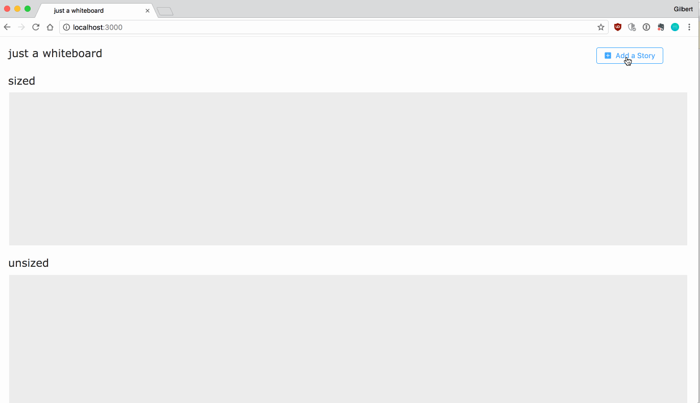

# just a whiteboard

A small tool for agile whiteboarding (or just playing around with drag and drop)

### How to Install

First:

```
npm install
```

then:

```
npm start
```

### Usage

So far, users can add stories/tasks, with sizes. Then, they can drag and drop them in either the sized or the unsized boxes, rearranging as needed. More functionality to come...



### Built With

* [React](https://reactjs.org/)
* [Redux](https://redux.js.org/)
* [react-beautiful-dnd](https://github.com/atlassian/react-beautiful-dnd)
